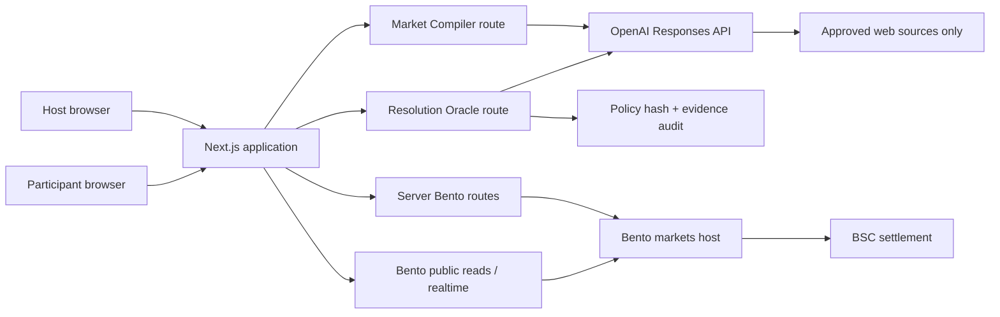

# MarketForge AI — Market Compiler + Resolution Oracle PRD

**Status:** Hackathon MVP
**Event:** Build on Bento — BLR Edition
**Build window:** Approximately 11:00 AM–5:00 PM
**Product thesis:** Describe a real-world question in plain English; AI compiles it into a Bento market with a source-locked resolution contract, then later proposes a cited outcome for human confirmation.

## 1. Executive summary

MarketForge AI lets a host convert a real-world question into a live, credit-based Bento prediction market in under 60 seconds. Unlike a form-filling assistant, it generates both the market and the rules by which that market can later be resolved.

The host describes an event in natural language, such as:

> Will the selected Bengaluru weather station report measurable rain between 5:30 PM and 6:30 PM today?

OpenAI converts that description into a structured binary market plus a resolution policy: exact criteria, resolution timestamp, approved source domains, evidence requirements, and an insufficient-evidence fallback. The host reviews and locks those fields before creating the market on Bento. Participants use Bento play credits to take a position while the odds update.

At resolution time, the host triggers the AI Resolution Oracle. OpenAI searches only the source domains locked when the market was created, returns the consulted sources and a cited proposed outcome, and explicitly reports conflicting or insufficient evidence. The host must review and confirm the final outcome before Bento receives a resolution request.

The hackathon demonstration should complete this loop:

```text
Describe → AI compiles market + resolution policy → Host locks rules
→ Bento creates → Audience bets → Oracle searches approved sources
→ Cited verdict → Host confirms → Bento resolves
```

## 2. Problem

Prediction markets are powerful but costly to create and difficult to resolve reliably. A creator must turn an informal claim into a precise question, define mutually exclusive outcomes, specify close and resolution times, select authoritative sources, and decide what happens when evidence is missing or contradictory.

Existing interfaces mainly help people discover and trade markets that already exist. Simple AI market creators solve only half the problem: a well-worded question can still become unresolvable if the authoritative source and decision rule were not fixed before trading. MarketForge treats creation and resolution as one contract.

## 3. Product principles

1. **The market is the product.** AI compiles and investigates; Bento owns market state, odds, positions, and settlement.
2. **Human authorization is mandatory.** AI never creates or resolves a market without explicit host confirmation.
3. **Resolution is designed at creation.** Criteria, timestamp, source domains, and insufficient-evidence behavior are locked before betting.
4. **Source-restricted, not open-ended.** The oracle may search only the approved domains embedded in the resolution policy.
5. **Abstention is a feature.** Conflicting or insufficient evidence returns `cannot resolve`; the model must never guess.
6. **Credits only for the MVP.** The demo must not use real-money collateral.
7. **One excellent loop beats many partial features.** The first milestone is one market completing the entire lifecycle.
8. **Pending is a real state.** Bento write acceptance is not the same as on-chain finality; the UI must show creation, bet, and resolution progress honestly.

## 4. Goals and non-goals

### Goals

- Generate a valid Bento-compatible market draft from one natural-language description.
- Generate a machine-readable resolution policy alongside every market.
- Let the host edit and approve every generated field before locking it.
- Create a public, play-credit Bento market.
- Let participants open the market from a QR code and place a bet.
- Show the current odds and recent movement during the betting window.
- At resolution time, search only the source domains locked at creation.
- Show a proposed outcome with visible, clickable citations and conflicts.
- Use AI to recommend—not execute—the resolution.
- Resolve the market only after host confirmation.
- Complete the full flow in a concise stage demo using a same-day market.

### Non-goals for the hackathon

- Real-money/USDC markets.
- Background scheduling; the hackathon oracle is triggered manually.
- Fully autonomous market creation or resolution.
- Arbitrary politics, medical, legal, financial, personal, or dangerous markets.
- Arbitrary multi-outcome markets; the Bento `createDuel` MVP is binary.
- Parlays, tournaments, fantasy contests, or the second Bento API host.
- Social profiles, creator monetization, referrals, or complex analytics.
- A native mobile application.
- Supporting both OpenAI and Claude in the MVP.

## 5. Target users

### Host/creator

A person who wants to launch a trustworthy prediction market without manually designing its schema and resolution process.

Examples: watch-party host, streamer, hackathon presenter, sports-club organizer, community market creator.

### Participant

A person physically present or watching remotely who wants to make a quick prediction and see how their view compares with the crowd.

## 6. Core user stories

### Host

- As a host, I can describe an upcoming event in one sentence.
- As a host, I can receive a complete, objective market draft.
- As a host, I can edit the question, options, close time, resolution time, approved sources, and evidence rule.
- As a host, I can see why an ambiguous market was rejected.
- As a host, I can lock the resolution policy before betting starts.
- As a host, I can create the market on Bento after reviewing it.
- As a host, I can display a QR code for participants.
- As a host, I can trigger the oracle when the resolution time arrives.
- As a host, I can see the AI's proposed outcome, sources, citations, conflicts, and confidence.
- As a host, I must explicitly confirm the outcome before resolution.

### Participant

- As a participant, I can scan a QR code and see the market.
- As a participant, I can connect/login and use play credits.
- As a participant, I can see current probabilities and choose an outcome.
- As a participant, I can enter a stake, review a quote, and place a bet.
- As a participant, I can see that my bet is pending, confirmed, or failed.
- As a participant, I can see the result after resolution.

## 7. Primary experience

### 7.1 Host creation flow

1. Host enters an event description.
2. Server sends the description plus product constraints to OpenAI.
3. OpenAI returns a schema-constrained `MarketSpec` containing a Bento market draft and `ResolutionPolicy`.
4. Server runs deterministic validation.
5. UI shows an editable preview, approved-source list, resolution timestamp, and warnings.
6. Host confirms **Lock rules and create market**.
7. Server calls Bento `createDuel` with `collateralMode: "credits"`.
8. UI displays **Creating on Bento…**.
9. Server polls the public catalog using the returned `duelId`.
10. When readable, UI enters **Market live** and displays its QR code.

### 7.2 Participant betting flow

1. Participant opens `/market/{duelId}` from the QR code.
2. App loads public market detail.
3. Participant authenticates with their wallet if necessary.
4. Participant selects outcome A or B and a credit stake.
5. App calls Bento `estimateBuy`.
6. App displays the current quote and expected shares.
7. Participant confirms.
8. App calls `placeBet` with a unique idempotency key.
9. UI shows **Bet accepted—confirming…** and reconciles through a read.
10. Market probability refreshes through realtime updates or polling.

### 7.3 Resolution flow

1. Resolution time arrives; for the MVP the host clicks **Run Oracle**.
2. Server loads the immutable `ResolutionPolicy` stored for the market.
3. OpenAI Responses API performs web search restricted to `allowedSourceDomains`.
4. Server captures returned sources and validates that cited URLs match the allowlist.
5. OpenAI returns `OracleVerdict`: proposed outcome, confidence, evidence, citations, conflicts, or `cannot resolve`.
6. UI displays the verdict with clearly visible, clickable source links.
7. Host selects the final outcome and acknowledges that AI is advisory.
8. Host clicks **Resolve on Bento**.
9. App submits Bento's resolution request.
10. UI shows **Resolution submitted** until public state confirms the result.

Manual outcome selection remains available when the oracle abstains or the market uses physical evidence. Optional image review is a P1 fallback, not the primary oracle path.

## 8. Market eligibility rules

A generated market is eligible only when all rules pass:

- It concerns a harmless, web-verifiable or directly observable event.
- It has exactly two mutually exclusive outcomes.
- A reasonable observer can determine the winner.
- The resolution rule states a measurable threshold, location, time window, and timezone where relevant.
- The market closes before the event begins.
- The resolution time occurs after the evidence should be available.
- At least one authoritative source domain is approved before creation for web-resolved markets.
- The policy defines what happens when sources are missing or conflicting.
- The event does not involve real-money wagering.
- It does not encourage injury, dangerous behavior, illegality, harassment, or exploitation.
- It does not target a private individual's sensitive traits or serious personal outcomes.
- The question does not contain subjective terms such as “good,” “impressive,” or “successful” unless those terms are replaced with measurable criteria.

If these rules cannot be satisfied, the AI response must set `eligible: false` and explain what the host needs to change.

## 9. Functional requirements

### P0 — required for submission

| ID | Requirement | Acceptance criterion |
|---|---|---|
| P0-01 | Natural-language market drafting | A valid description returns a structured draft in under 10 seconds. |
| P0-02 | Eligibility rejection | An ambiguous or unsafe description is rejected with a specific correction. |
| P0-03 | Resolution contract | Every eligible draft includes criteria, timestamp, allowed domains, search query, evidence requirement, and fallback. |
| P0-04 | Editable host confirmation | No Bento creation request occurs before the host locks and confirms the full specification. |
| P0-05 | Credit market creation | Created markets always use `collateralMode: "credits"`. |
| P0-06 | Creation reconciliation | The app polls by `duelId` until the market is publicly readable or times out. |
| P0-07 | QR sharing | A live market has a scannable participant URL. |
| P0-08 | Bet quote | Participant receives a fresh Bento estimate before confirmation. |
| P0-09 | Bet placement | A confirmed bet uses the returned quote and an idempotency key. |
| P0-10 | Honest mutation states | UI distinguishes accepted, confirmed, failed, and timed-out writes. |
| P0-11 | Source-restricted oracle | The resolver searches only domains locked at creation and returns the full source list. |
| P0-12 | Cited verdict | The UI shows a proposed outcome or abstention with clickable citations and conflicts. |
| P0-13 | Human resolution | Only the authenticated creator can confirm and submit resolution. |
| P0-14 | Manual fallback | Host can resolve when the oracle abstains, with an explicit acknowledgement. |
| P0-15 | Demo backup | At least one same-day backup market is ready before judging. |

### P1 — add after the core loop works

- Live WebSocket probability animation.
- QR room with participant count.
- AI-generated cover art or event card.
- Celebration screen showing winning outcome.
- Voice input using browser speech recognition or OpenAI transcription.
- AI image evidence review for physical-event markets.

### P2 — post-hackathon

- Background scheduling and automatic oracle triggering.
- Multiple independent oracle runs and consensus.
- Creator templates for cricket, football, esports, and physical challenges.
- Multi-market event rooms.
- Direct structured-data adapters for trusted weather and sports feeds.
- Creator reputation and disputed-resolution workflows.
- Embeddable widgets for streams and watch parties.

## 10. OpenAI integration

### 10.1 API and model

Use the OpenAI **Responses API**, which OpenAI recommends for new projects and which supports Structured Outputs, image inputs, web search, domain filters, returned source metadata, and citations.

Configuration:

```env
OPENAI_API_KEY=...
OPENAI_MODEL=gpt-5.6-terra
```

Use `gpt-5.6-terra` when available because current model guidance positions it as the balance between capability and cost. Keep the model in an environment variable so the team can switch to another vision- and Structured-Outputs-capable model available to the account without changing code.

The OpenAI key must exist only on the server. The browser calls internal routes such as `/api/ai/draft-market`; it never calls OpenAI directly.

### 10.2 AI responsibility A: compile a market and resolution contract

Input:

```json
{
  "eventDescription": "Will the selected Bengaluru weather station report measurable rain between 5:30 PM and 6:30 PM today?",
  "currentTime": "2026-07-18T11:30:00+05:30"
}
```

Required structured output:

```ts
type ResolutionPolicy = {
  method: "web" | "manual";
  rule: string;
  resolutionTime: string;
  timezone: string;
  allowedSourceDomains: string[];
  sourceQuery: string;
  evidenceRequired: string;
  insufficientEvidencePolicy: "manual_review" | "cancel";
};

type MarketSpec = {
  eligible: boolean;
  rejectionReason: string | null;
  question: string;
  type: "prediction" | "versus";
  optionA: string;
  optionB: string;
  category: "Weather" | "Cricket" | "Football" | "Esports" | "Live Challenge" | "Other";
  description: string;
  startTime: string;
  endTime: string;
  ambiguityWarnings: string[];
  resolutionPolicy: ResolutionPolicy;
};
```

Server-side Zod validation must enforce:

- Question length: 10–140 characters.
- Exactly two non-empty, distinct options under 40 characters.
- ISO 8601 times with explicit timezone handling.
- `startTime < endTime <= resolutionTime`.
- One objectively determinable winner.
- One to five approved domains for web-resolved markets.
- Domains contain hostnames only, never arbitrary URLs or protocols.
- The source query cannot broaden or contradict the locked rule.
- `eligible` is false when ambiguity, safety, sourcing, or timing cannot be fixed without user input.

Prompt contract:

```text
You compile plain-English requests into short-lived, play-credit Bento markets.
Return one objective binary market and the complete policy for resolving it.
Never invent a measurement, location, timestamp, or authoritative source.
Reject subjective, unsafe, illegal, sensitive, or unresolvable requests.
For web resolution, choose a small set of authoritative source domains and state
the exact evidence required. You only draft; the human creator locks the rules.
```

Use the JavaScript SDK's schema parsing pattern:

```ts
const response = await openai.responses.parse({
  model: process.env.OPENAI_MODEL!,
  input: [
    { role: "system", content: MARKET_COMPILER_PROMPT },
    { role: "user", content: JSON.stringify(input) },
  ],
  text: {
    format: zodTextFormat(MarketSpecSchema, "market_spec"),
  },
});

const marketSpec = response.output_parsed;
```

Structured Outputs are required because invalid enums, missing policy fields, and malformed timestamps must not reach Bento.

### 10.3 AI responsibility B: source-locked Resolution Oracle

The oracle does not settle a market. It searches approved sources, analyzes evidence against the immutable rule, and proposes a verdict for human review.

Oracle input:

- Final question and option labels.
- Immutable `ResolutionPolicy`.
- Current resolution timestamp.
- Bento `duelId` for audit logging only.

Required output:

```ts
type OracleVerdict = {
  canResolve: boolean;
  proposedOutcomeIndex: 0 | 1 | null;
  confidence: "low" | "medium" | "high";
  summary: string;
  supportingEvidence: Array<{
    claim: string;
    sourceUrl: string;
    sourceTitle: string;
  }>;
  conflictingEvidence: string[];
  manualReviewReason: string | null;
};
```

Use Responses API web search with domain filtering and returned source metadata:

```ts
const response = await openai.responses.parse({
  model: process.env.OPENAI_MODEL!,
  reasoning: { effort: "low" },
  tools: [
    {
      type: "web_search",
      filters: {
        allowed_domains: policy.allowedSourceDomains,
      },
    },
  ],
  tool_choice: "required",
  include: ["web_search_call.action.sources"],
  input: buildOraclePrompt({ question, optionA, optionB, policy }),
  text: {
    format: zodTextFormat(OracleVerdictSchema, "oracle_verdict"),
  },
});
```

Server verification after the response:

1. Extract every URL from `web_search_call.action.sources` and citation annotations.
2. Reject any evidence URL whose hostname is outside `allowedSourceDomains`.
3. Reject any model-returned citation not present in the actual returned source set.
4. Store the verdict, query, source list, timestamp, and policy hash as an audit record.
5. Render citations as visible, clickable links.
6. Require the creator to choose the final outcome and confirm that the oracle is advisory.

Oracle rules:

- Return `canResolve: false` when evidence is unavailable, stale, contradictory, or does not exactly match the rule.
- Never substitute a new source at resolution time.
- Never reinterpret or rewrite the resolution policy after betting starts.
- Never submit a Bento mutation directly.
- Do not treat model confidence as proof; the cited evidence is the review surface.

### 10.4 Optional physical-evidence fallback

For a live physical challenge, the host may upload an image. OpenAI vision can return observations and a proposed outcome using the same `OracleVerdict` shape, but it must return `canResolve: false` when the image does not directly establish the rule. Image review is P1 and never replaces the manual fallback.

### 10.5 AI failure behavior

- Market compilation times out after 12 seconds; oracle search after 20 seconds.
- Retry once only for transient failures.
- Do not retry schema refusals, eligibility rejections, or oracle abstentions.
- Preserve the original description and draft so the host can edit and retry.
- Market creation remains available through a manual structured form if OpenAI is unavailable.
- Oracle failure never blocks the creator's explicit manual-resolution path.
- Never cache an old oracle verdict as if it were fresh; display its run timestamp.

## 11. Bento integration

### 11.1 SDK setup

Install:

```bash
npm install @bento.fun/sdk
```

Use the markets host only for P0:

```env
BENTO_URL=https://internal-server.bento.fun
BENTO_BUILDER_API_KEY=bnt_...
```

Initialize the SDK with the Builder API key and a wallet auth provider. Catalog reads are public, while login, market creation, betting, and resolution require the appropriate authenticated context.

### 11.2 Bento capability map

| Product requirement | Bento SDK capability | Notes |
|---|---|---|
| Load a market | `sdk.public.getDuelById({ duelId })` | Always use `duelId`, not the database row `id`. |
| Browse backup markets | `sdk.public.listDuels({ page, limit, collateralStack: "credits" })` | Public read. |
| Create market | `sdk.user.createDuel(...)` | Creator JWT + Builder API key required. |
| Quote a bet | `sdk.user.bets.estimateBuy(...)` | Call immediately before placement. |
| Place a bet | `sdk.user.placeBet(...)` | Pass quote fields and an idempotency key. |
| Confirm a position | `sdk.user.bets.getUserShares(...)` | Reconcile after accepted write. |
| Live updates | SDK `RealtimeClient.subscribeToDuel(...)` | Confirm testnet availability at kickoff; polling is fallback. |
| Store resolution policy | `description` plus `ruleSpec` in `createDuel` | Persist a local immutable copy and verify backend support for returning `ruleSpec`. |
| Resolve market | `sdk.user.duels.resolve(...)` | Creator-authenticated; host confirmation required. |

### 11.3 Create-market mapping

The compiled `MarketSpec` is mapped to Bento only after validation and host confirmation:

```ts
const result = await sdk.user.createDuel(
  {
    question: marketSpec.question,
    type: marketSpec.type,
    category: marketSpec.category,
    description: [
      marketSpec.description,
      `Resolution: ${marketSpec.resolutionPolicy.rule}`,
      `Resolution time: ${marketSpec.resolutionPolicy.resolutionTime}`,
      `Approved sources: ${marketSpec.resolutionPolicy.allowedSourceDomains.join(", ")}`,
    ].join("\n\n"),
    optionA: marketSpec.optionA,
    optionB: marketSpec.optionB,
    startTime: marketSpec.startTime,
    endTime: marketSpec.endTime,
    privacyAccess: "public",
    collateralMode: "credits",
    tags: ["marketforge", "ai-oracle"],
    ruleSpec: {
      source: "marketforge-ai",
      humanConfirmed: true,
      lockedAt: new Date().toISOString(),
      policyVersion: 1,
      ...marketSpec.resolutionPolicy,
    },
  },
  { requestId: crypto.randomUUID() },
);

const { duelId, txHash } = result.raw;
```

`createDuel` returning successfully means the request was accepted. Poll `getDuelById({ duelId })` every two seconds, with a visible timeout state, before declaring the market live.

### 11.4 Betting mapping

Amounts use on-chain base units with 18 decimals. Centralize conversion and never use JavaScript floating-point math for stakes.

```ts
const stake = parseUnits(String(credits), 18).toString();

const estimate = await sdk.user.bets.estimateBuy({
  duelId,
  optionIndex,
  betAmountUsdc: stake,
  slippageBps: 100,
});

if (!estimate.success) throw new Error("Quote rejected");

await sdk.user.placeBet(
  {
    duelId,
    duelType: "prediction",
    bet: optionIndex === 0 ? "optionA" : "optionB",
    optionIndex,
    betAmount: stake,
    betAmountUsdc: stake,
    sharesOut: estimate.estimate.shares_out,
    minSharesOut: estimate.estimate.min_shares_out,
    slippageBps: 100,
    quoteId: estimate.estimate.quote_id,
  },
  { idempotencyKey: crypto.randomUUID() },
);
```

Do not reuse old quotes. If the odds move or the quote expires, estimate again.

### 11.5 Resolution mapping

After the host reviews the cited oracle verdict—or explicitly selects the manual fallback—and confirms the final result:

```ts
await sdk.user.duels.resolve({
  duelIds: [
    {
      duelId,
      winningOptionIndex: confirmedOutcomeIndex,
    },
  ],
});
```

Treat the response as a submitted mutation. Continue polling market detail until the public state reflects resolution or the UI reaches a timeout and offers a manual refresh.

The oracle must never receive Bento credentials and must never call `resolve`. Only the authenticated creator path may translate `confirmedOutcomeIndex` into the Bento mutation.

### 11.6 Bento questions to verify at kickoff

Ask a Bento engineer these questions before committing to the final demo sequence:

1. Does the hackathon testnet allow participant wallets to receive play credits automatically?
2. What creator balance or collateral is required to create a credit market?
3. Is `sdk.user.duels.resolve` enabled for builder-created testnet markets, and what is the normal finality time?
4. What exact market status values represent betting-open, closed, resolving, and resolved?
5. Is the duel realtime WebSocket enabled on the hackathon host?
6. Can participants use a Bento weblink/login flow that minimizes wallet onboarding?
7. Are there minimum market durations or limits enforced by the backend?
8. Does `ruleSpec` round-trip through public market reads, or must MarketForge store and hash it independently?
9. Does Bento provide a cancel/invalid outcome path when the locked policy cannot produce sufficient evidence?

## 12. System architecture



Recommended stack:

- Next.js + TypeScript.
- Tailwind CSS or existing component library for speed.
- `@bento.fun/sdk` for Bento.
- `openai` + `zod` for model calls and schemas.
- `viem` for wallet and `parseUnits`.
- SQLite or a small durable store for immutable resolution policies and oracle audit records; Bento remains the source of truth for market state.

Server-only routes:

```text
POST /api/ai/draft-market
POST /api/ai/run-oracle
POST /api/ai/review-image
POST /api/bento/create-market
POST /api/bento/resolve-market
```

Public/client operations may read Bento directly if Builder key exposure is not required. All secrets and creator-authorized mutations stay server-side.

## 13. Minimal data model

```ts
type MarketRoom = {
  id: string;
  creatorWallet: string;
  status:
    | "draft"
    | "creating"
    | "live"
    | "closed"
    | "reviewing"
    | "resolving"
    | "resolved"
    | "failed";
  marketSpec: MarketSpec;
  policyHash: string;
  policyLockedAt?: string;
  duelId?: string;
  creationTxHash?: string;
  confirmedOutcomeIndex?: 0 | 1;
  latestOracleRun?: OracleRun;
  createdAt: string;
};

type OracleRun = {
  id: string;
  duelId: string;
  policyHash: string;
  searchedAt: string;
  query: string;
  returnedSources: Array<{ title: string; url: string }>;
  verdict: OracleVerdict;
};
```

The policy hash prevents accidental edits between creation and resolution. Do not duplicate balances, odds, shares, or final market state locally; read those from Bento.

## 14. UX requirements

### Host screen

- Large prompt input with three example chips.
- AI drafting state under ten seconds with progressive status copy.
- Editable preview containing question, options, market times, resolution time, rule, approved domains, and evidence requirement.
- Eligibility warnings shown before the create button.
- Confirmation checkbox: “I reviewed and am locking this market and its resolution policy.”
- Projector mode with QR code, countdown, live odds, and participant activity.
- Oracle screen showing run timestamp, proposed outcome, confidence, conflicts, full source list, and clickable citations.
- Resolution screen that clearly separates the AI proposal from the host's final decision.

### Participant screen

- Question and countdown visible without scrolling.
- Two large outcome buttons.
- Current probability and stake presets: 5, 10, 25 credits.
- Quote review before final confirmation.
- Explicit pending and confirmed states.
- No jargon such as “duel,” “wei,” or “optionIndex” in user-facing copy.

## 15. Security, safety, and reliability

- Never expose `OPENAI_API_KEY` or `BENTO_BUILDER_API_KEY` to the client.
- Validate every AI field again in deterministic server code.
- Bind creator-only actions to the authenticated creator wallet.
- Rate-limit market compilation and oracle routes.
- Hash and lock the resolution policy before trading begins.
- Restrict web search to the locked `allowedSourceDomains`.
- Verify cited URLs against the actual returned source list and domain allowlist.
- Store source URLs, query, timestamp, policy hash, and verdict for auditability.
- Render every source citation as a visible, clickable link.
- If P1 image review is enabled, accept only image MIME types and enforce upload-size limits.
- Escape AI-generated text before rendering.
- Require idempotency keys for Bento mutations.
- Use credits only.
- Store oracle verdicts as advisory evidence, not as the authoritative outcome.
- Log correlation IDs, `duelId`, transaction hash, and state transitions without logging private keys, signatures, JWTs, or API keys.
- Provide manual creation and manual-resolution fallbacks.

## 16. Success metrics

### Hackathon success

- Full create-to-resolve loop completes once before judging.
- A judge can understand the product within ten seconds.
- Five or more participants place a play-credit prediction during the demo.
- Live odds visibly change after audience participation.
- No secret is exposed in browser source or logs.
- The oracle searches only locked source domains and displays at least one verified citation.
- The host, not the model, performs the final resolution action.

### Future product metrics

- Median time from description to market live.
- AI draft acceptance rate without editing.
- Percentage of generated drafts rejected for ambiguity.
- Participant conversion from QR open to placed prediction.
- Oracle runs marked `cannot resolve`.
- Oracle citations rejected by server verification.
- Contested or corrected resolutions.

## 17. Six-hour execution plan

### Two-person ownership

**Person 1 — Bento and state**

- Wallet authentication and Builder key.
- `createDuel`, public reconciliation, betting, and resolution.
- Immutable policy storage, audit record, and server-only mutation routes.

**Person 2 — OpenAI and experience**

- `MarketSpec` Structured Output and validation.
- Source-restricted oracle, citation extraction, and verdict UI.
- Host creation, participant, and projector interfaces.

Both people test the first complete create → bet → resolve loop together before visual polish.

### 11:00–11:40 — prove Bento and compiler in parallel

- Person 1 obtains the Builder key and test credits, authenticates the creator, creates one manual credit market, places one bet, and tests resolution.
- Person 2 implements `MarketSpecSchema`, one weather/source template, deterministic validation, and three rejection tests.

**Gate:** Do not build polished UI until Bento's create/bet/resolve path works or an engineer provides a confirmed fallback.

### 11:40–12:30 — host creation and policy locking

- Connect the compiler route to the editable host form.
- Display and validate resolution rule, time, allowed domains, and evidence requirement.
- Hash and persist the policy when the host confirms.
- Map the locked specification into Bento `createDuel`.

### 12:30–1:30 — participant betting

- Build market page, QR route, stake presets, estimate, confirmation, and placement.
- Implement pending, confirmed, expired-quote, and retry states.
- Reconcile user shares after an accepted bet.

### 1:30–2:30 — Resolution Oracle

- Implement Responses API `web_search` with `allowed_domains`.
- Request full source metadata and capture citation annotations.
- Validate source domains and URLs server-side.
- Return structured `OracleVerdict` and persist `OracleRun`.
- Test resolved, conflicting, and insufficient-evidence cases.

### 2:30–3:15 — human confirmation and Bento resolution

- Build cited-verdict review screen.
- Require final outcome selection and advisory acknowledgement.
- Submit Bento resolution only from the authenticated creator route.
- Reconcile public resolved state.
- Preserve manual fallback when the oracle abstains.

### 3:15–4:00 — live experience and optional P1

- Add projector mode, probability visualization, and two-second polling.
- Use realtime subscription if confirmed available.
- Add image review only if the web-oracle path is already reliable.

### 4:00–5:00 — hardening and rehearsal

- Create one web-resolved same-day market and one manual/physical backup market.
- Test with multiple phones.
- Verify domain filtering, citation links, QR code, mobile layout, network behavior, and key security.
- Rehearse the full pitch three times.
- Record a backup video of the successful flow.

## 18. Demo script

Prepare a same-day market early enough that its authoritative source publishes the result before judging. A weather observation is suitable only after confirming that the chosen official source is accessible and updates quickly at the venue.

1. Presenter: “Creating a market is easy. Creating one that can be resolved fairly is the hard part.”
2. Enter a plain-English question with location and time, such as a same-day weather observation.
3. AI produces the binary market plus its resolution contract: exact criterion, timestamp, approved domains, evidence requirement, and fallback.
4. Presenter highlights that these rules are locked before trading, then creates the Bento market.
5. QR code appears; judges and attendees predict with credits.
6. Projector shows the Bento probability moving.
7. When the prepared market is due, presenter clicks **Run Oracle**.
8. Oracle searches only the pre-approved domains and returns a proposed outcome, conflicts, confidence, and clickable citations.
9. Presenter opens a citation, confirms the final outcome, and submits Bento resolution.
10. Show the resolved or submitted-resolution state and winning side.

Closing line:

> MarketForge does not just generate a market. It generates the contract for proving how that market ends.

## 19. Demo contingencies

| Failure | Fallback |
|---|---|
| OpenAI is slow | Use a cached example draft, visibly labeled, or manual form. |
| Market creation is slow | Open the same-day backup Bento market. |
| Wallet onboarding stalls | Use pre-authenticated team devices for audience representatives. |
| Realtime socket fails | Poll market detail every two seconds. |
| Approved source is unavailable | Demonstrate the correct `cannot resolve` state and use the explicit manual-review policy. |
| Sources conflict | Show abstention as a trust feature; do not force an AI verdict. |
| Citation verification fails | Hide the unsupported claim and fall back to manual review. |
| Resolution finality is slow | Show “Resolution submitted” with transaction/request evidence. |
| Venue network fails | Play the recorded backup while explaining the live architecture. |

## 20. Definition of done

The MVP is done when:

- A host description becomes an editable, schema-valid `MarketSpec` and `ResolutionPolicy`.
- The host locks the policy, and the app stores its hash before betting.
- The host creates a public credits market on Bento.
- The app waits until Bento exposes the market publicly.
- A second user estimates and places a bet.
- The UI confirms the position through a read.
- The oracle searches only locked source domains and returns verified source metadata.
- The UI displays either a cited verdict or an explicit abstention.
- The authenticated host selects an outcome and submits resolution.
- The app shows the final or submitted-resolution state.
- The complete flow is rehearsed on the venue network.

## 21. References

### Bento

- [Bento SDK introduction](https://docs.bento.fun/)
- [Quickstart and authentication](https://docs.bento.fun/quickstart)
- [How Bento works](https://docs.bento.fun/concepts/how-bento-works)
- [Create a market](https://docs.bento.fun/guides/create-market)
- [Place a bet](https://docs.bento.fun/guides/place-bet)
- [Common patterns and pitfalls](https://docs.bento.fun/reference/common-patterns)

### OpenAI

- [Model selection](https://developers.openai.com/api/docs/models)
- [Responses API migration and recommendation](https://developers.openai.com/api/docs/guides/migrate-to-responses)
- [Structured Outputs](https://developers.openai.com/api/docs/guides/structured-outputs)
- [Web search, domain filters, sources, and citations](https://developers.openai.com/api/docs/guides/tools-web-search)
- [Images and vision](https://developers.openai.com/api/docs/guides/images-vision)
